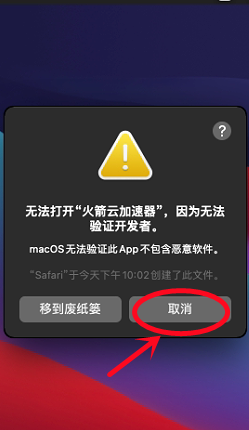
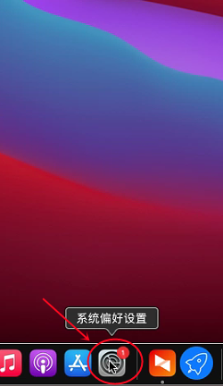
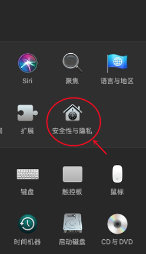
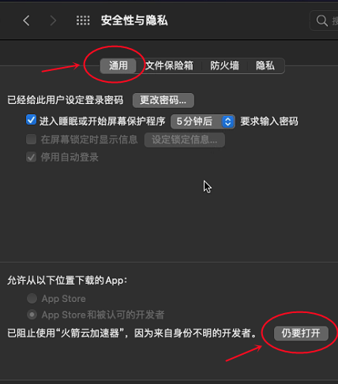

# MAC OS-无法验证开发者

### 解决办法：

点击取消---点击电脑上的----设置----安全性与隐私---通用---仍然打开

<figure><figcaption></figcaption></figure>

 

<figure><figcaption></figcaption></figure>

 

<figure><figcaption></figcaption></figure>

 

<figure><figcaption></figcaption></figure>

